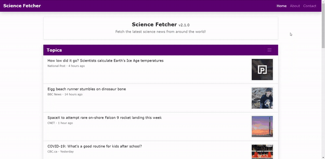

# Science Fetcher

## Overview
Science Fetcher is a webapp able to fetch articles on the latest science news from Google News as a faster alternative to a Google search.

## Changelog

### 2.1.1 (2020-08-27)
* Added warning badge for technology topic yielding less results than expected
* Changed contact and 404 card to not stretch to the entire page
* Changed alt attribute to not be empty on load
* Fixed exploit involving sending unwanted URLs to backend by adding escape code to URL and moving topic map to backend

### 2.1.0 (2020-08-26)
* Added thumbnails to articles
* Added feature to prevent fetching while already fetching
* Changed topic selection to be a collapsible menu
* Changed article to be clickable
* Changed date to display time since posted
* Changed article list and header to not stretch to the entire page
* Changed about page navigation bar to not stretch to the entire page
* Improved webscraping code: RSS feed is no longer used, error handling, and storing data in objects
* Improved 404 page
* Improved error handling for missing data (connection error)
* Improved script: changed values for readability, cleaner display labels, and session storage improvement
* Fixed open graph title for home page
* Removed some obsolete styles in stylesheet

### 2.0.1 (2020-08-23)
* Added sitemap link to footer on home page
* Added error handling for connection error and missing data
* Added more SEOs: removed X-Powered-By header and heading tag improvements
* Improved favicons with compressed images, site names, and theme colors
* Fixed security issue allowing access to all root files by allowing access to files only in public directory

### 2.0.0 (2020-08-21)
* Redesigned entire site with Bootstrap 4
* Added 6 topics to choose from: general, space, tech, biology, computing, and physics
* Added date underneath article titles
* Added footer to home page
* Added and improved about page contents
* Added feature to fetch articles when page loads
* Added post request to backend for getting articles
* Added local storage for removing first visit guide
* Added session storage for remembering last selected button
* Added 404 page to backend instead of redirecting to home page
* Added more SEOs: favicons, social media, sitemap
* Improved script.js (no more bundled code)
* Improved fetching function to get articles from backend
* Improved style.css to work with Bootstrap
* Improved backend by serving compressed responses
* Changed favicon design
* Changed page titles
* Removed obsolete meta tags

### 1.1.0 (2020-08-09)
* Added text stroke and shadows to headers
* Added gradient to site header
* Added underline to links when hovered over

### 1.0.2 (2020-08-08)
* Added non-secure to secure redirect
* Added 404 to home page redirect

### 1.0.1 (2020-08-08)
* Added canonical tags
* Added shadow for navigation bar
* Added feature to remove .html extension in URLs
* Added comment for bundled info about script.js

### 1.0.0 (2020-08-07)
* Clicking button fetches 15 articles with links
* 3 pages: home, about (2 sections), and contact (mail to email)
* Navigation bar fixed to the bottom